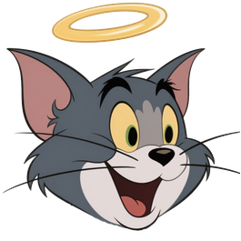
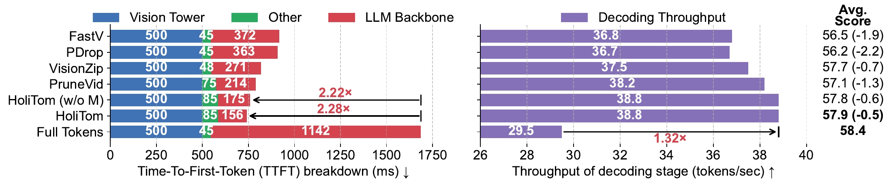
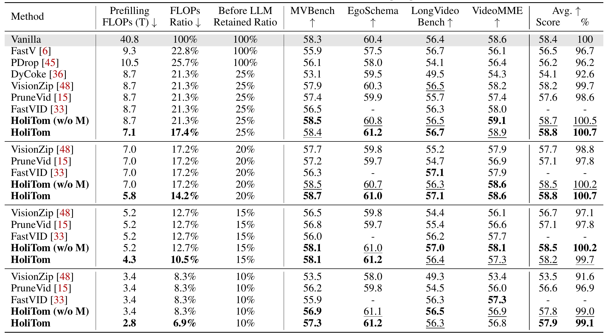
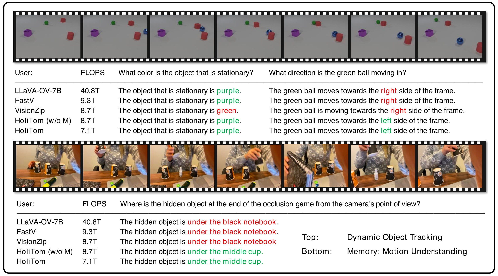

<p align="center" style="margin-bottom: 0px;">

</p>

<div align="center">
<h1>HoliTom</h1>

<div align="center">
<a href="https://arxiv.org/abs/2505.21334">

<a href="https://cokeshao.github.io/HoliTom_Web/">

<a href="https://opensource.org/licenses/Apache-2.0">

</a>

</div>
<h3>Holistic Token Merging for Fast Video Large Language Models</h3>
</div>

<p align="center">


</p>

#### 🔥🔥🔥 News

- **2025-09-20:** HoliTom has been accepted by **NeurIPS'25** 🎉
- **2025-05-28:** The repo, paper, and webpage is released.

## Introduction
> **HoliTom: Holistic Token Merging for Fast Video Large Language Models** [[arXiv]](https:)   
> *[Kele Shao](https://cokeshao.github.io/), [Keda Tao](https://kd-tao.github.io/), [Can Qin](https://canqin.tech/), [Haoxuan You](https://hxyou.github.io/), [Yang Sui](https://eclipsess.github.io/yangsui.github.io/), [Huan Wang](https://huanwang.tech/)*   
> Abstract: Video large language models (video LLMs) excel at video comprehension but face significant computational inefficiency due to redundant video tokens. Existing token pruning methods offer solutions. However, approaches operating within the LLM (inner-LLM pruning), such as FastV, incur intrinsic computational overhead in shallow layers. In contrast, methods performing token pruning before the LLM (outer-LLM pruning) primarily address spatial redundancy within individual frames or limited temporal windows, neglecting the crucial global temporal dynamics and correlations across longer video sequences. This leads to sub-optimal spatio-temporal reduction and does not leverage video compressibility fully. Crucially, the synergistic potential and mutual influence of combining these strategies remain unexplored. To further reduce redundancy, we introduce HoliTom, a novel training-free holistic token merging framework. HoliTom employs outer-LLM pruning through global redundancy-aware temporal segmentation, followed by spatial-temporal merging to reduce visual tokens by over 90%, significantly alleviating the LLM's computational burden. Complementing this, we introduce a robust inner-LLM token similarity-based merging approach, designed for superior performance and compatibility with outer-LLM pruning. Evaluations demonstrate our method's promising efficiency-performance trade-off on LLaVA-OneVision-7B, reducing computational costs to 6.9% of FLOPs while maintaining 99.1% of the original performance. Furthermore, we achieve a 2.28× reduction in Time-To-First-Token (TTFT) and a 1.32× acceleration in decoding throughput, highlighting the practical benefits of our integrated pruning approach for efficient video LLMs inference.

## Installation
Our code is easy to use.
1. Install the [LLaVA-NeXT](https://github.com/LLaVA-VL/LLaVA-NeXT) environment.
2. Replace the [siglip_encoder.py](https://github.com/cokeshao/HoliTom/blob/main/LLaVA-NeXT/llava/model/multimodal_encoder/siglip_encoder.py) to get the attention in vision tower.
3. To install our HoliTom method, simply clone the repository and run the following command:

```bash
git clone https://github.com/cokeshao/HoliTom
cd HoliTom
pip install -e .
```

## Quick Start
Check out [example.py](https://github.com/cokeshao/HoliTom/blob/main/example.py#L27) for a simple demonstration.
```python
from llava.model.builder import load_pretrained_model
tokenizer, model, image_processor, max_length = load_pretrained_model(
    model_path = "lmms-lab/llava-onevision-qwen2-7b-ov",
    model_base = None,
    model_name = "llava_qwen",
    attn_implementation = "sdpa",
    multimodal = True, 
)    # load the model

from holitom import holitom
model = holitom(model)   # wrap the model
```
By setting environment variables, we can control the hyperparameters. For example: \
``WRAPPER=holitom RETAIN_RATIO=0.15 T=0.80 CUDA_VISIBLE_DEVICES=0 python example.py``

## Evaluation 
We use [lmms-eval](https://github.com/EvolvingLMMs-Lab/lmms-eval) to evaluate our models. After loading the model, simply wrap the model. You can check the modifications in [llava_onevision.py](https://github.com/cokeshao/HoliTom/blob/main/lmms_eval/models/llava_onevision.py#L139) for more detail. 
Here is an example:
```bash
WRAPPER=holitom RETAIN_RATIO=0.15 T=0.80 HOLITOM_k=18 HOLITOM_r=0.5 CUDA_VISIBLE_DEVICES=0,1,2,3,4,5,6,7 \
accelerate launch --num_processes=8 --main_process_port=25000 \
-m lmms_eval \
--model llava_onevision \
--model_args pretrained=lmms-lab/llava-onevision-qwen2-7b-ov,conv_template=qwen_1_5,model_name=llava_qwen,max_frames_num=32 \
--tasks mvbench,egoschema,videomme,longvideobench_val_v \
--batch_size 1 \
--log_samples \
--log_samples_suffix llava_onevision \
--output_path ./logs/ov-7b-holitom/0.15
```
The scripts in the [scripts](https://github.com/cokeshao/HoliTom/blob/main/scripts) folder will guide you through the evaluation.
```bash
bash scripts/eval_ov-7b_holitom.sh
```

As the existing [VisionZip](https://github.com/dvlab-research/VisionZip) open-source code does not support LLaVA-OneVision and LLaVA-Video, we have made our adapted code available in the [visionzip](https://github.com/cokeshao/HoliTom/blob/main/visionzip) folder.
We hope this will be a valuable resource for the open-source community. We sincerely appreciate the foundational work done by VisionZIP. The usage is the same as above; simply change _WRAPPER_. For example:
```bash
WRAPPER=visionzip SPATIAL_TOKENS=30 CUDA_VISIBLE_DEVICES=0,1,2,3,4,5,6,7 \ ...
```

## 👀 Results
### Comparison of state-of-the-art methods across benchmarks
**Best** and **most efficient** results are in bold, _second best_ underlined. Here, "HoliTom" means the full version of our method; "HoliTom (w/o M)" means our method *without* inner-LLM merging, for reference.
<p align="center">  </p>

### Comparison on Challenging Video Understanding
<span style="color: #00B050">Green</span>: correct results, <span style="color: #C00000">Red</span>: incorrect results. Our method is able to produce correct answers on challenging video tasks.
<p align="center">  </p>

## Acknowledgement
- This work is built upon [LLaVA-NeXT](https://github.com/LLaVA-VL/LLaVA-NeXT), [lmms-eval](https://github.com/EvolvingLMMs-Lab/lmms-eval), and [VisionZip](https://github.com/dvlab-research/VisionZip). We thank them for their excellent open-source contributions.

- We also thank [FastV](https://github.com/pkunlp-icler/FastV), [PruneVid](https://github.com/Visual-AI/PruneVid), [FastVID](https://arxiv.org/abs/2503.11187), and others for their contributions, which have provided valuable insights.


## Contact

If you have any questions, please feel free to contact with me at shaokele [at] gmail [dot] com

## Citation

If you find this work useful for your research, please consider citing our paper:

```bibtex
@inproceedings{shao2025holitom,
  title={Holitom: Holistic token merging for fast video large language models},
  author={Shao, Kele and Tao, Keda and Qin, Can and You, Haoxuan and Sui, Yang and Wang, Huan},
  booktitle=NeurIPS,
  year={2025}
}
```
